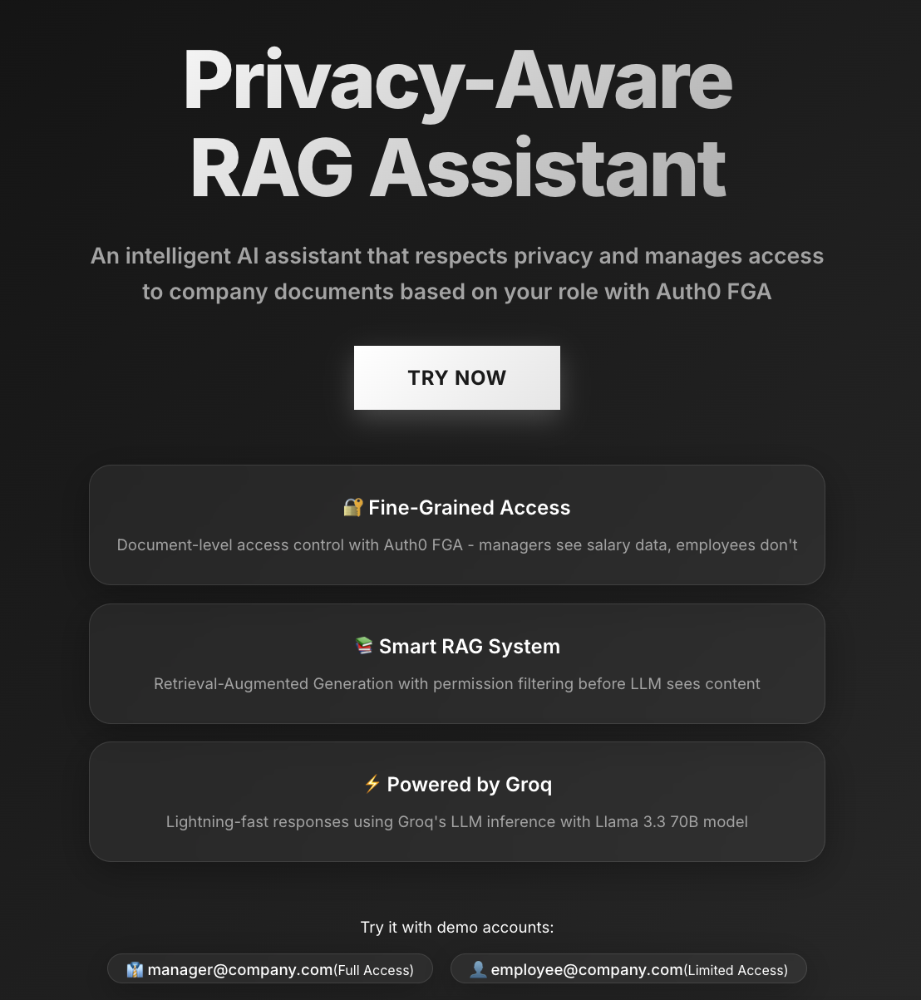
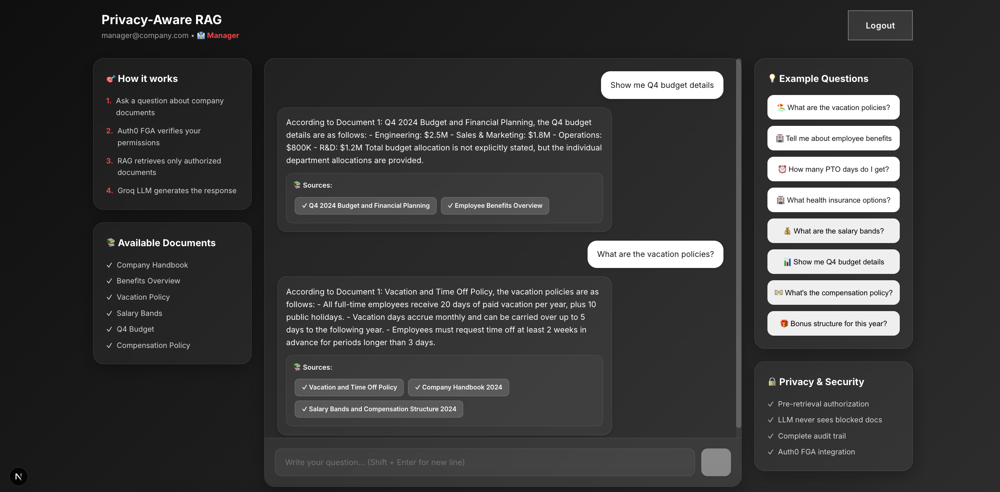

# Privacy-Aware RAG Bot 🔒

An internal HR knowledge assistant built with **Next.js**, **Auth0**, **OpenFGA**, and **Groq LLM** that demonstrates fine-grained document access control in a RAG (Retrieval-Augmented Generation) system.

## 🎯 Project Goal

Build a privacy-aware chatbot that:
- ✅ Sources answers from a document database using RAG
- ✅ Enforces document-level access based on user roles (Manager vs Employee)
- ✅ Uses **Auth0 FGA** for fine-grained authorization
- ✅ Demonstrates that sensitive documents (salary info, budgets) are **blocked** for unauthorized users **before** reaching the LLM

## 🔐 Success Criteria

✓ **Managers** can access all documents including:
  - Salary bands and compensation
  - Company budgets
  - Sensitive HR information

✓ **Employees** can only access:
  - General company policies
  - Benefits overview
  - Vacation policies

✓ **Authorization happens BEFORE retrieval** - the LLM never sees unauthorized content

## 🏗️ Architecture

```
User Question
    ↓
Auth0 Authentication (who are you?)
    ↓
OpenFGA Authorization (what can you see?)
    ↓
RAG Document Retrieval (filtered by permissions)
    ↓
Groq LLM (generates answer from authorized docs only)
    ↓
Response + Metadata (shows blocked document count)
```

## 🛠️ Tech Stack

- **Next.js 15** - React framework with App Router
- **TypeScript** - Type safety
- **Auth0** - Authentication
- **OpenFGA** - Fine-grained authorization (with mock fallback)
- **Groq** - Fast, free LLM API (Llama 3.3 70B)
- **Pure CSS** - Custom styling with dark theme

## 📸 Screenshots

### Landing Page
Clean, modern landing page with vertical feature cards and demo account information:
- Dark gradient background (gray/white/black theme)
- Privacy-aware messaging
- "Try Now" call-to-action button
- Three key features: Fine-Grained Access, Smart RAG System, Powered by Groq



### Chat Interface (Manager View)
Authenticated manager view with full document access:
- Three-column layout with sidebar information
- 8 example questions (4 general + 4 manager-only in red)
- Document list showing access permissions
- Real-time FGA authorization feedback
- Chat interface with 85vh height for comfortable conversations



### Chat Interface (Employee View)
Limited access for regular employees:
- Same layout but restricted document access
- Only 4 general example questions visible
- Red X marks on restricted documents (Salary Bands, Q4 Budget, Compensation Policy)
- Clear visual feedback on blocked documents in chat responses


## 🚀 Getting Started

### 1. Clone and Install

```bash
cd privacy-aware-rag-bot
npm install
```

### 2. Set Up Auth0

1. Go to [Auth0 Dashboard](https://manage.auth0.com/)
2. Create a new **Regular Web Application**
3. Configure settings:
   - **Allowed Callback URLs**: `http://localhost:3000/api/auth/callback`
   - **Allowed Logout URLs**: `http://localhost:3000`
   - **Allowed Web Origins**: `http://localhost:3000`
4. Copy your credentials to `.env.local`

### 3. Get Groq API Key (FREE, no credit card)

1. Go to [Groq Console](https://console.groq.com/)
2. Sign up for a free account
3. Generate an API key
4. Add to `.env.local` as `GROQ_API_KEY`

### 4. Configure Environment Variables

Create `.env.local` file:

```bash
cp .env.example .env.local
```

Then edit `.env.local` with your credentials:

```env
# Generate secret: openssl rand -hex 32
AUTH0_SECRET='your_generated_secret_here'
AUTH0_BASE_URL='http://localhost:3000'
AUTH0_ISSUER_BASE_URL='https://YOUR_DOMAIN.auth0.com'
AUTH0_CLIENT_ID='your_client_id'
AUTH0_CLIENT_SECRET='your_client_secret'

# Free Groq API key
GROQ_API_KEY='gsk_your_groq_key_here'

# Optional: Real OpenFGA (app uses mock if not set)
# FGA_API_URL='https://api.us1.fga.dev'
# FGA_STORE_ID='your_store_id'
# FGA_MODEL_ID='your_model_id'
```

### 5. Run the Application

```bash
npm run dev
```

Open [http://localhost:3000](http://localhost:3000)

## 🧪 Testing Authorization

### Test as Manager

1. Log in with an email containing "manager" or "admin" (e.g., `manager@company.com`)
2. Ask: **"What are the salary bands?"**
3. ✅ You'll see salary information from the `salary_2024` document

### Test as Employee

1. Log in with a regular email (e.g., `employee@company.com`)
2. Ask: **"What are the salary bands?"**
3. ❌ Access denied - document is blocked, LLM responds with "no access to salary information"
4. You'll see: **"🔒 N documents blocked due to insufficient permissions"**

### Example Queries

- "What are the vacation policies?" (✅ All users)
- "Tell me about employee benefits" (✅ All users)
- "How many PTO days do I get?" (✅ All users)
- "What health insurance options?" (✅ All users)
- "What are the salary bands?" (✅ Managers only)
- "Show me the Q4 budget" (✅ Managers only)
- "What's the compensation policy?" (✅ Managers only)
- "Bonus structure for this year?" (✅ Managers only)

## 📂 Project Structure

```
privacy-aware-rag-bot/
├── app/
│   ├── api/
│   │   └── chat/
│   │       └── route.ts          # Chat API with FGA checks
│   ├── layout.tsx
│   └── page.tsx                  # Main chat UI
├── components/
│   ├── ChatInterface.tsx         # Interactive chat component
│   ├── LoginButton.tsx
│   └── LogoutButton.tsx
├── lib/
│   ├── auth0.ts                  # Auth0 configuration
│   ├── fga.ts                    # OpenFGA authorization logic
│   ├── documents.ts              # Document database
│   ├── rag.ts                    # RAG retrieval with filtering
│   └── groq.ts                   # Groq LLM integration
├── middleware.ts                 # Auth0 middleware
├── .env.example
└── README.md
```

## 🔍 Key Implementation Details

### Authorization Flow (lib/fga.ts)

```typescript
// Check if user can access a document
export async function checkDocumentAccess(
  userId: string,
  documentId: string
): Promise<boolean>
```

### RAG with Privacy (lib/rag.ts)

```typescript
// Filter documents BEFORE retrieval
const accessibleDocs = await filterAccessibleDocuments(userId, allDocumentIds);

// Only search within authorized documents
const results = searchDocuments(query, accessibleDocs);
```

### Document Categories

**Public (All Users):**
- `company_handbook` - Company policies
- `benefits_overview` - Benefits information
- `vacation_policy` - Time off policies

**Sensitive (Managers Only):**
- `salary_2024` - Salary bands
- `compensation_policy` - Compensation structure
- `budget_q4_2024` - Financial planning

## 🎓 Learning Outcomes

This project demonstrates:

1. **Fine-Grained Authorization** - Role-based access at the document level
2. **Privacy-First RAG** - Authorization happens BEFORE retrieval
3. **Secure LLM Integration** - LLM never sees unauthorized content
4. **Real-World Use Case** - HR/Legal bots with sensitive data
5. **Modern Stack** - Next.js 15, TypeScript, Auth0, OpenFGA

## 🔒 Security Features

- ✅ Authentication required for all chat requests
- ✅ Per-document authorization checks via FGA
- ✅ Documents filtered BEFORE LLM sees them
- ✅ Audit trail (console logs show access decisions)
- ✅ Metadata shows blocked document count to user

## 🐛 Troubleshooting

### "Unauthorized" Error
- Make sure you're logged in
- Check Auth0 credentials in `.env.local`

### "Failed to generate response"
- Verify `GROQ_API_KEY` is set correctly
- Check [Groq status](https://status.groq.com/)

### Authorization Not Working
- App uses **mock FGA** by default (works without FGA setup)
- Manager = email contains "manager" or "admin"
- Employee = all other emails

## 📚 Resources

- [Auth0 Quickstart](https://auth0.com/docs/quickstart/webapp/nextjs)
- [OpenFGA Documentation](https://openfga.dev/docs)
- [Groq API Docs](https://console.groq.com/docs)
- [Next.js App Router](https://nextjs.org/docs/app)

## 🎉 Demo Ready!

This project is ready to demonstrate:
1. User authentication with Auth0
2. Role-based document access (Manager vs Employee)
3. RAG system with privacy controls
4. LLM responses based only on authorized documents
5. Clear visibility into blocked/allowed documents

---

**Built for GHW AI/ML Workshop** - Privacy-Aware RAG with Auth0 FGA
